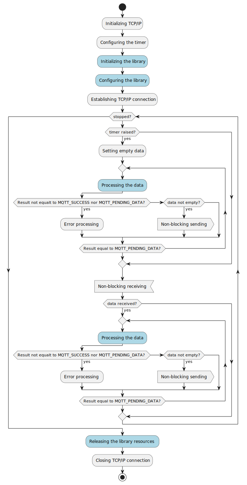

# MQTT Client Library
## Trademarks
All referenced product or service names and trademarks are the property of their respective owners.
| Trademark | Description |
|------|-------------|
| MQTT | MQTT is an OASIS standard messaging protocol for the Internet of Things (IoT). It is designed as an extremely lightweight publish/subscribe messaging transport that is ideal for connecting remote devices with a small code footprint and minimal network bandwidth. MQTT today is used in a wide variety of industries, such as automotive, manufacturing, telecommunications, oil and gas, etc. [^1] |
| PlantUML | PlantUML is a versatile component that enables swift and straightforward diagram creation. Users can draft a variety of diagrams using a simple and intuitive language.[^2]|
| Home Assistant| Open source home automation that puts local control and privacy first. Powered by a worldwide community of tinkerers and DIY enthusiasts. Perfect to run on a Raspberry Pi or a local server.[^3] |
## Introduction
The aim of this repo is to demonstrate possibilities as well as usage of the `libmqttcli.a` library.
## Features
- Supports the client side of the MQTT [^1] protocol.
- Is relatively easy to use. The user does not need to know details of the MQTT protocol. The library automatically prepares the following packets: `CONNECT`, `AUTH`, `DISCONNECT`, `PUBACK` and `PINGREQ`. The user via library interface is allowed to prepare the following packets: `PUBLISH`, `SUBSCRIBE` and `DISCONNECT`.
- The whole library contains proprietary implementation. There are no third party implementations included. The following external standard functions are used: `malloc`, `memcpy` and `memcmp`.
- The library is totally written in C89 standard.
- The library does not establish any internet connection. Received or prepared packets shall be exchanged by the user.
- Specific behavior could be added using callback functions, e.g., client authentication to the broker.
## Usage
### Requirements
The library is not exchanging packets via internet as well as it is not conscious of elapsed time, therefore the user shall support the library with these aspects. To achieve this the following elements shall be designed in the program flow:
- The timer should be configured to generate an interrupt after a specified period of time, hereinafter referred to as `timeout`. If the `timeout` was detected then empty packet shall be presented to the `process` function as it was presented on <a href="#fig01">Fig. 1</a>.
- If any data was received it shall be presented to the `process` function (<a href="#fig01">Fig. 1</a>).
- If shall be checked if `process` function has prepared any data to send. If any data was prepared then it must be send to the broker. The `process` function shall be repeated until it returns the `MQTT_SUCCESS` reason code, hereinafter referred to as `rc`.
- If the `process` function has returned other `rc` than `MQTT_PENDING_DATA`, then an appropriate actions shall be take into account.

<p align="center">
  <a name="fig01"> 
   </br>
  <b>Fig. 1. Program flow (generated with PlantUML). </b>
  </a>
</p>

The following sections names corresponds to the lightblue actions presented on <a href="#fig01">Fig. 1</a>.

### Initializing the library
The first step is to initialize the library. It shall be performed as follows:
```C
mqtt_cli cli;

mqtt_cli_init( &cli );
```
### Configuring the library
The second step is to configure the library:
```C
const uint16_t timeout = 1;
const uint32_t srv_ip = 0xC0A80201;
const uint16_t keep_alive = 60;

cli.set_timeout( &cli, timeout);
cli.set_br_ip( &cli, srv_ip);
cli.set_br_keepalive( &cli, keep_alive );
```
### Processing the data
### Preparing *PUBLISH* package
```C
const char *topic = "sensor01";
const char *message = "ON";
uint8_t buffer[1024] = { 0 };
const lv_t cli_topic = { .length=strlen(topic), .value=(uint8_t*)topic  };
const lv_t cli_message = { .length=strlen(message), .value=(uint8_t*)message  };
clv_t data = { .capacity=sizeof(buffer)/sizeof(uint8_t), .value=buffer };
mqtt_publish_params_t params;

params.message = message;
params.properties.length = 0;
params.properties.value = NULL;
params.topic = topic;
cli.publish_ex( &cli, &params, &data);
```
### Preparing *SUBSCRIBE* package
### Releasing the library resources
To avoid memory leaks in the program, the library resources must be released if only they are not needed anymore.
```C
mqtt_cli_destr( &cli );
```
## Examples
| Link | Description |
|------|-------------|
|[mqtt.c](examples/mqtt.c/README.md)| Demonstrates using publish and subscribe packets in MQTT protocol. Could be used as a diagnostic tool. |
|[hadev.c](examples/hadev.c/README.md)| Simulator of the Home Assistant device. It is supporting discovery process to automatically add the device in Home Assistant board. |

## References
[^1]: [https://mqtt.org](https://mqtt.org)
[^2]: [https://plantuml.com](https://plantuml.com)
[^3]: [https://www.home-assistant.io](https://www.home-assistant.io)
