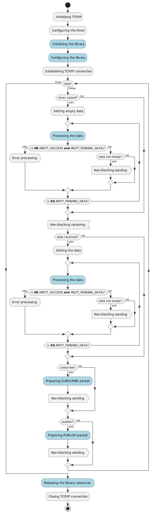

# MQTT Client Library
## Introduction
The aim of this repo is to demonstrate possibilities as well as usage of the `libmqttcli.a` library.
## Features
- Supports the client side of the MQTT protocol.
- Is relatively easy to use. The user does not need to know details of the MQTT protocol. The library automatically prepares the following packets: `CONNECT`, `AUTH`, `DISCONNECT`, `PUBACK` and `PINGREQ`. The user via library interface is allowed to prepare the following packets: `PUBLISH`, `SUBSCRIBE` and `DISCONNECT`.
- The whole library contains proprietary implementation. There are no third party implementations included. The following external standard functions are used: `malloc`, `memcpy` and `memcmp`.
- The library is totally written in C89 standard.
- The library does not establish any internet connection. Received or prepared packets shall be exchanged by the user.
- Specific behaviour could be added using callback functions, e.g., client authentication to the broker.
## Usage
### Requirements
The library is not exchanging packets via internet as well as it is not conscious of ellapsed time, therefore the user shall perform these actions additionally. To achieve this the following shall be designed in the program flow:
- The timer should be configured to generate an interrupt after a specified period of time, hereinafter referred to as `timeout`. If the `timeout` was detected then empty packet shall be presented to the `process` function
- If any data was received it shall be presented to the `process` function.
- If shall be checked if `process` function has prepared any data to send. If any data was prepared then it must be send to the broker. The `process` function shall be repeated untill it teturns the `MQTT_SUCCESS` reason code.
- If the `process` function has returned other reason than `MQTT_PENDING_DATA`, an apropriate actions shall be take into account.

<p align="center">
   </br>
  <b> Fig. 1. Program flow. </b>
</p>

### Initialisation
The first step is to initialize the library.
```
mqtt_cli cli;

mqtt_cli_init( &cli );
```
### Configuration
The second step is to configure the library.
```
const uint16_t timeout = 1;
const uint32_t srv_ip = 0xC0A80201;
const uint16_t keep_alive = 60;

cli.set_timeout( &cli, timeout);
cli.set_br_ip( &cli, srv_ip);
cli.set_br_keepalive( &cli, keep_alive );
```
### Sending publish package
```
const char *topic = "sensor01";
const char *message = "ON";
uint8_t buffer[1024] = { 0 };
const lv_t cli_topic = { .length=strlen(topic), .value=(uint8_t*)topic  };
const lv_t cli_message = { .length=strlen(message), .value=(uint8_t*)message  };
clv_t data = { .capacity=sizeof(buffer)/sizeof(uint8_t), .value=buffer };
mqtt_publish_params_t params;

params.message = message;
params.properties.length = 0;
params.properties.value = NULL;
params.topic = topic;
cli.publish_ex( &cli, &params, &data);
```
### Sending subscribe package
### Processing packages
### Closing the library
```
mqtt_cli_destr( &cli );
```
## Examples
| Link | Description |
|------|-------------|
|[mqtt.c](src/mqtt.c/README.md)| Demonstrates using publish and subscribe packets in MQTT protocol. Could be used as a diagnostic tool. |
|[hadev.c](src/hadev.c/README.md)| Simulator of the Home Assistant device. It is using discovery process to automatically add the device. |
