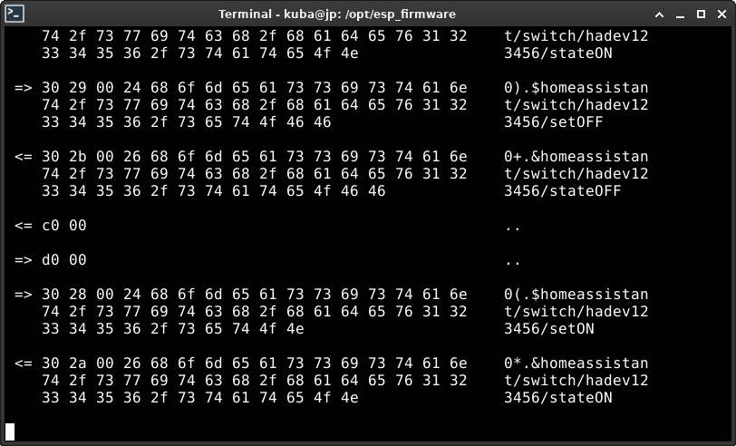
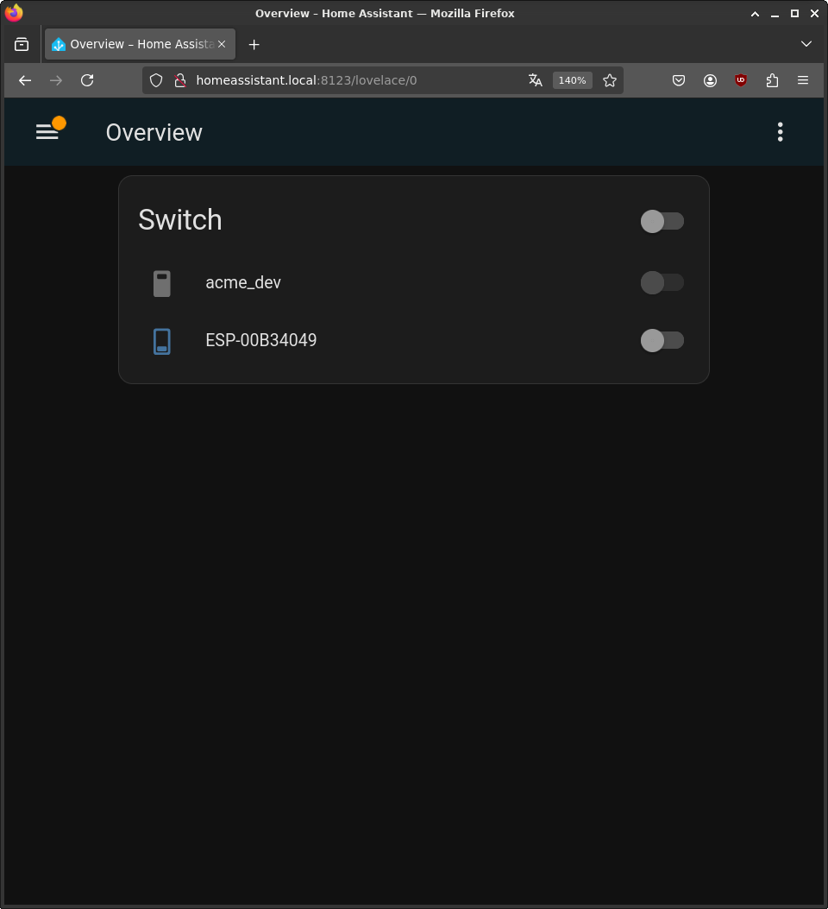
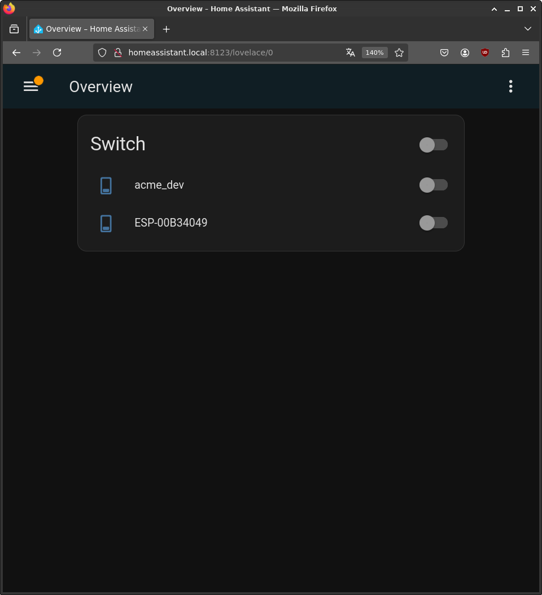
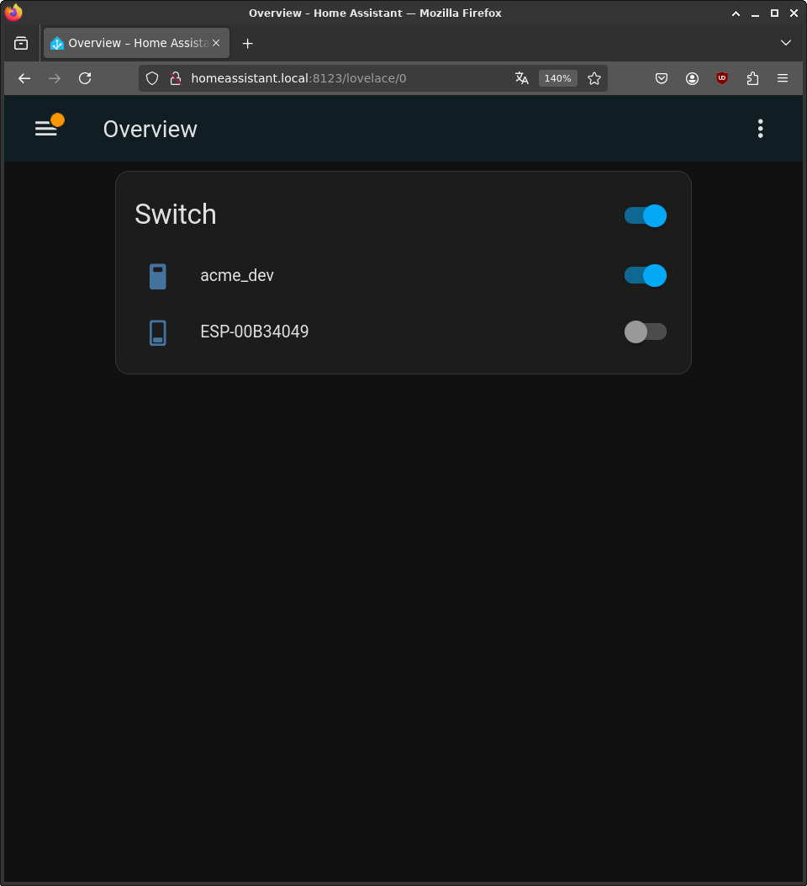

# hadev
## NAME
&emsp;hadev - simulates a switch device connected to the Home Assistant
## SYNOPSIS
&emsp;hadev _[-b size] [-P password] [-p port] [--reuse-addr] [-I user_id] [-N user_name] [-v]_  
## DESCRIPTION
&emsp;Connects to the broker plugin installed in Home Asistant OS using specified credentials, allows to discover new `switch` device and performs normal operations typical for this device - turn on, turn off. The `switch` device could be controled via Home Assistant Board as well as from the application. Each time `switch` device state is changed it is reflected on Home Assistant Board. Disconnected `switch` device will be disabled in Home Asistant board.

&emsp;_-b size, --buffer-size size_  
&emsp;&emsp;Uses specified in bytes buffer size which is used to receive and send new packets. By default 1024 B size is used.   
&emsp;_-h host, --host host_  
&emsp;&emsp;Uses specified host to connect to. By default localhost is used.  
&emsp;_-P password, --password password_  
&emsp;&emsp;Uses specified password. By default none password is iused.   
&emsp;_-p port, --port port_  
&emsp;&emsp;Uses specified port number to connect to. By default 1884 port is used.  
&emsp;_--reuse-addr_  
&emsp;&emsp;Indicates that the rules used in validating addresses supplied in a `bind` call should allow reuse of local addresses. By default it is disabled.  
&emsp;_-I user_id, --userid user_id_  
&emsp;&emsp;Uses specified user ID. By default randomly generated user id is used.  
&emsp;_-N user_name, --username user_name_  
&emsp;&emsp;Uses specified user name. By default none user name is iused.  
&emsp;_-v, --verbose_  
&emsp;&emsp;Starts the program in a verbose mode. By default this option is disabled.  

# Examples
1. Client establishes connection to the `homeassistant.local` and starts working as typical switch device.
```
hadev -h homeassistant.local -p 8123 -I UID12345678 -N testuser12345678 -P homeassistantpassword -v
```
# Screenshots
Typical use cases of the program were presented on: <a href="#fig01">Fig. 1</a>, <a href="#fig02">Fig. 2</a>, <a href="#fig03">Fig. 3</a> and <a href="#fig04">Fig. 4</a>.

<p align="center">
  <a name="fig01"> 
   </br>
  <b>Fig. 1. hadev program - console view. </b>
  </a>
</p>

<p align="center">
  <a name="fig02"> 
   </br>
  <b>Fig. 2. acme device disconnected - Home Assistant view. </b>
  </a>
</p>

<p align="center">
  <a name="fig03"> 
   </br>
  <b>Fig. 3. acme device off - Home Assistant view. </b>
  </a>
</p>

<p align="center">
  <a name="fig04"> 
   </br>
  <b>Fig. 4. acme device on - Home Assistant view. </b>
  </a>
</p>
